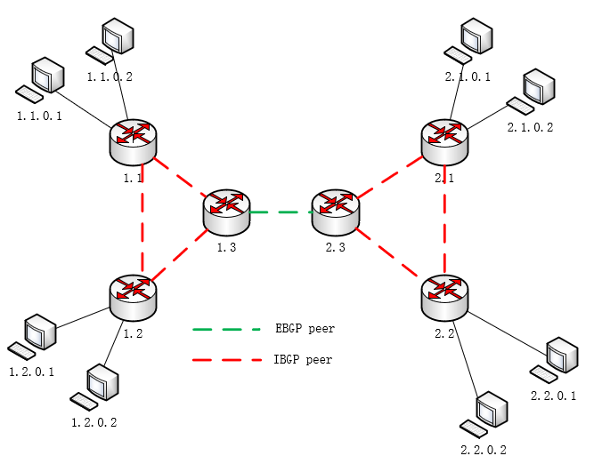

# 测试拓扑

- 联邦控制器监听端口 101
- AS1控制器监听联邦控制器端口 111
- AS1控制器监听其他控制器端口 112
- AS2控制器监听联邦控制器端口 211
- AS2控制器监听其他控制器端口 212

- 图变换部分
- 联邦控制器监听端口2101
- AS1控制器监听联邦控制器端口2111
- AS2控制器监听联邦控制器端口2211
- AS1控制器监听BGP消息端口2121
- AS2控制器监听BGP消息端口2221